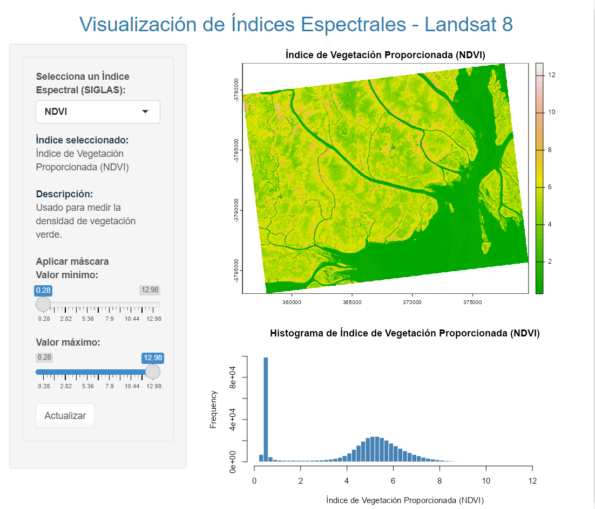

# Visualización de Índices Espectrales - Aplicación Shiny

Esta aplicación en `R` utilizando `Shiny` permite visualizar diferentes índices espectrales y composiciones RGB a partir de imágenes multiespectrales de Landsat 8. El código está diseñado para cargar una imagen multiespectral de Landsat 8, calcular varios índices espectrales y mostrar estas composiciones a través de gráficos, histogramas y la posibilidad de descargar los resultados.

## Ejemplo de la Aplicación




La imagen de ejemplo muestra la interfaz de la aplicación donde se visualizan las composiciones RGB y los índices espectrales ajustados, junto con sus histogramas.

## Requisitos previos

- Necesitas una imagen multiespectral de Landsat 8 en formato `.tif` que contenga todas las bandas necesarias para calcular los índices.
- **Las imágenes deben tener aplicadas correcciones atmosféricas, radiométricas y geométricas previamente.**
- La imagen debe ser cargada a través de la interfaz de la aplicación y no requiere una ruta específica en el código.

## ¿Qué es una imagen multiespectral de Landsat 8?

Una imagen multiespectral de Landsat 8 contiene múltiples bandas que representan diferentes partes del espectro electromagnético. Estas bandas se utilizan para calcular índices espectrales que ayudan a analizar características de la superficie terrestre como vegetación, agua, áreas quemadas, etc.

### Ejemplo de bandas en Landsat 8:

- **Banda 2:** Azul
- **Banda 3:** Verde
- **Banda 4:** Rojo
- **Banda 5:** Infrarrojo cercano (NIR)
- **Banda 6:** Infrarrojo de onda corta (SWIR 1)
- **Banda 7:** Infrarrojo de onda corta (SWIR 2)

## Composiciones RGB disponibles

La aplicación permite visualizar varias composiciones RGB para resaltar diferentes características de la imagen:

- **Color Natural (Banda 4, Banda 3, Banda 2):** Representa los colores naturales como los vería el ojo humano.
- **Infrarrojo Rojo (Banda 5, Banda 4, Banda 3):** Resalta la vegetación usando la banda infrarroja cercana.
- **Tierra Agua (Banda 5, Banda 6, Banda 4):** Diferencia entre tierra y agua, destacando cuerpos de agua.
- **Vegetación (Banda 6, Banda 5, Banda 4):** Realza la vegetación y permite identificar áreas verdes.
- **Infrarrojo (Banda 7, Banda 5, Banda 4):** Usa bandas infrarrojas para destacar características del terreno.
- **Área Urbana (Banda 7, Banda 6, Banda 4):** Enfatiza áreas urbanas con tonos específicos.
- **Geología (Banda 7, Banda 4, Banda 2):** Útil para análisis geológicos y detección de suelos.
- **Agricultura (Banda 6, Banda 5, Banda 2):** Destaca áreas agrícolas para estudios de cultivos.
- **Nieve Nube (Banda 2, Banda 6, Banda 7):** Diferencia nieve y nubes, útil en zonas montañosas.
- 

## Índices calculados

La aplicación calcula varios índices espectrales, cada uno con un propósito específico y permite visualizar su fórmula:

- **NDVI (Índice de Vegetación Normalizado):** Mide la densidad de vegetación verde.
- **DVI (Índice de Vegetación Diferencial):** Mide la diferencia entre la vegetación infrarroja y roja.
- **NDWI (Índice Diferencial de Agua Normalizada):** Detecta cuerpos de agua en áreas húmedas.
- **EVI (Índice de Vegetación Mejorada):** Mejora el NDVI al reducir efectos atmosféricos.
- **TVI (Índice de Vegetación Transformado):** Resalta el contraste de la vegetación.
- **ARVI (Índice de Vegetación Atmosféricamente Resistente):** Resistente a los efectos atmosféricos.
- **SAVI (Índice de Vegetación Ajustado al Suelo):** Corrige el efecto del suelo desnudo en áreas con poca vegetación.
- **LAI (Índice de Área Foliar):** Mide la cantidad de área foliar verde.
- **BSI (Índice de Suelo Desnudo):** Identifica áreas de suelo desnudo.
- **NDSI (Índice Diferencial Normalizado de Nieve):** Detecta nieve en áreas nevadas.
- **NBR (Índice Normalizado de Área Quemada):** Detecta áreas afectadas por incendios.

## Cómo usar la aplicación

1. Carga la imagen multiespectral a través de la interfaz de carga.
2. Ejecuta la aplicación en R usando `Shiny`.
3. Selecciona la composición RGB o el índice espectral de interés.
4. Ajusta los valores mínimos y máximos utilizando los deslizadores para aplicar una máscara a los valores que te interesen.
5. Visualiza el índice y su histograma en tiempo real.
6. Descarga los índices ajustados según tus necesidades.

```r
shinyApp(ui = ui, server = server)

```
# Créditos
Desarrollado por AndersonDHL, basado en imágenes de Landsat 8.
